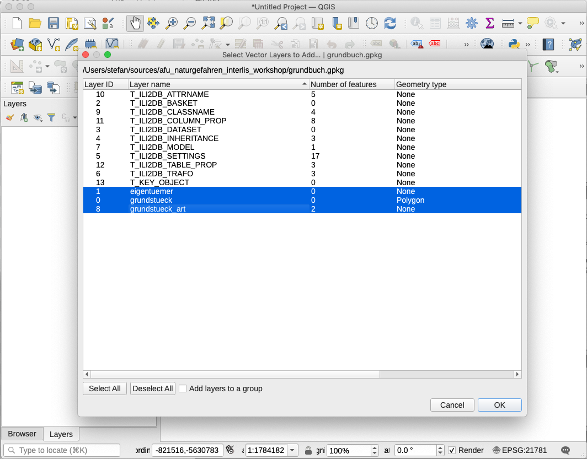
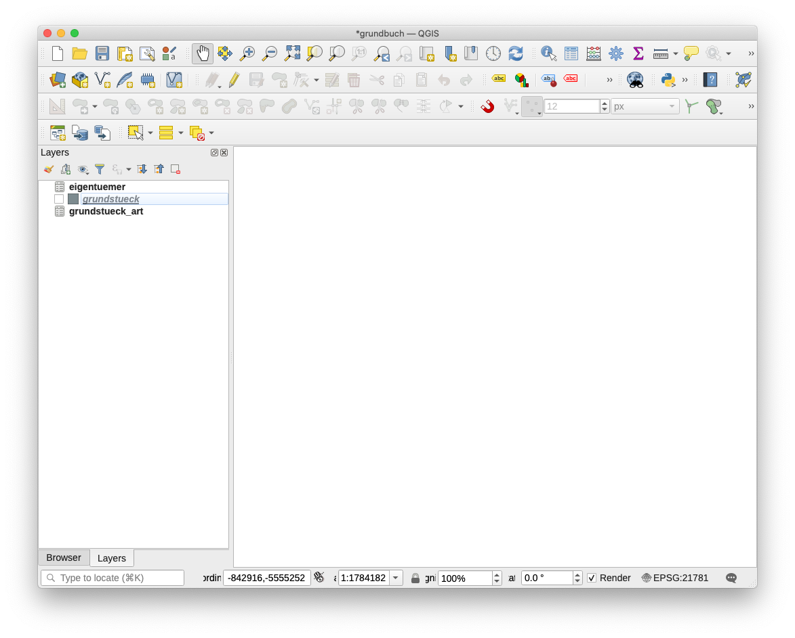

# Workshop "Herstellen von korrekten INTERLIS-Daten in der Gefahrenkartierung"

## Einleitung

Die Lieferung von digitalen Naturgefahrendaten im INTERLIS-Transferformat gemäss dem kantonalen Modell `Naturgefahrenkarte_SO_V11` bereitet teilweise Mühe. Der Workshop zeigt _eine_ (neben vielen anderen) Möglichkeiten wie man Daten modellkonform erfasst und fehlerfrei an den Kanton liefern kann.

## Werkzeuge

- [QGIS 3.14](https://www.qgis.org/de/site/forusers/download.html). Die Version ist nicht relevant, solange es nicht eine uralte Version ist.
- Java 1.8+, z.B [https://adoptopenjdk.net/](https://adoptopenjdk.net/)
- [ili2gpkg](http://www.eisenhutinformatik.ch/interlis/ili2gpkg/)
- [ilivalidator-web-service](https://geo.so.ch/ilivalidator) resp. [Standalone-Ilivalidator](https://github.com/claeis/ilivalidator/releases). Anleitungen [hier](https://github.com/sogis/ilivalidator-web-service-websocket/blob/master/docs/user-manual-de.md) und [hier](https://github.com/claeis/ilivalidator/blob/master/docs/ilivalidator.rst).
- Optional [dbeaver](https://dbeaver.io/download/) als Datenbankclient.

## Grundprinzip

In der hier gezeigten Herstellungsvariante werden zuerst in einer lokalen, dateibasierten Datenbank (GeoPackage) leere Tabellen angelegt. Die Tabellen in dieser Datenbank entsprechen den Tabellen (`TABLE`) im INTERLIS-Datenmodell. Aufzähltypen werden ebenfalls als Tabellen in der Datenbank angelegt. Anschliessend werden in QGIS die Datenbanktabellen ("QGIS-Layer") korrekt miteinander verknüpft. Mit den QGIS-Bordmitteln können die Daten erfasst werden oder aus Shapefiles o.ä. kopiert werden. Wurden sämtliche Daten erfasst, können die Tabellen (jetzt mit Daten gefüllt) in eine INTERLIS-Datei exportiert werden und anschliessend auf ihre Korrektheit geprüft werden.

Mit dem QGIS-Plugin "QGIS Model Baker" steht für die oben erwähnten Schritte ein Werkzeug zur Verfügung, dass einiges automatisiert. Für das bessere Grundverständnis der Prozesse, wird auf die Verwendung des Plugins verzichtet.

## Beispiel 1

Für das erste Beispiel wird bewusst nicht das Naturgefahrenmodell verwendet, sondern ein ganz simples Modell mit nur zwei Tabellen: Grundstücke und Eigentümer.

```
    TABLE Grundstueck =
      Nummer: TEXT*255;
      Art: (Liegenschaft, Baurecht);
      Geometrie: AREA WITH (STRAIGHTS) VERTEX LKoord WITHOUT OVERLAPS > 0.05;
      NO IDENT
    END Grundstueck;
    
    TABLE Eigentuemer =
      Name: TEXT*255;
      Grundstueck: -> Grundstueck;
      IDENT Name;
    END Eigentuemer;    
```

Ein Eigentümer muss einerm Grundstück zugewiesen werden.

Befehl zum Anlegen der leeren Datenbanktabellen in der GeoPackage-Datei:

```
java -jar /Users/stefan/apps/ili2gpkg-4.4.1/ili2gpkg-4.4.1.jar --dbfile grundbuch.gpkg --defaultSrsCode 21781 --strokeArcs --createEnumTabs --models AVGB --modeldir . --schemaimport
```
- `--dbfile`: Namen der GeoPackage (lokale Datenbank), die erstellt werden soll.
- `--defaultSrsCode 21781`: Wir müssen der Datenbank mitteilen welches Koordinatensystem es verwenden soll. Weil das Naturgefahrenmodell noch in LV03 ist, verwende ich hier ebenfalls LV03 (=21781).
- `--strokeArcs`: Kreisbogen werden zu kleinen Segmenten umgerechnet resp. in der Datenbank wird ein einfacherer (technischer) Geometrietyp verlangt.
- `--createEnumTabs`: Erstellt für jeden Aufzähltyp (hier `Art`) eine eigene Tabelle mit den Aufzähltypwerten.
- `--models`: Der Namen des INTERLIS-Datenmodelles.
- `--modeldir`: Die Url des INTERLIS-Repositories oder des lokalen Verzeichnisses, wo die INTERLIS-Datei gespeichert ist. Falls wir ein offizielles Modell verwenden, das in einem Repository gespeichert ist, ist diese Angabe überflüssig.
- `--schemaimport`: Damit teilen wir der Software mit, dass sie leere Tabellen erstellen soll und z.B. keine Daten importieren soll.

Die GeoPackage-Datei `grundbuch.gpkg` kann in das QGIS-Hauptfenster gezogen werden und es müssen die drei Layer ausgewählt werden:



Es handelt sich dabei um zwei "Datenlayer" und einen Layer mit den Aufzähltypwerten der Grunstücksart.



Die Tabellen `Grundstueck` und `Eigentuemer` sind gemäss Modell miteinander verknüpft: Jeder Eigentümer ist einem Grundstück zugewiesen. Im QGIS-Layer 

## Beispiel 2