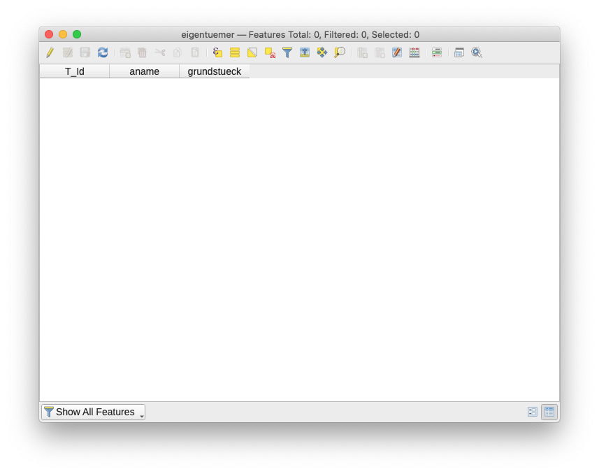

# Workshop "Herstellen von korrekten INTERLIS-Daten in der Gefahrenkartierung"

## Einleitung

Die Lieferung von digitalen Naturgefahrendaten im INTERLIS-Transferformat gemäss dem kantonalen Modell `Naturgefahrenkarte_SO_V11` bereitet teilweise Mühe. Der Workshop zeigt _eine_ (neben vielen anderen) Möglichkeiten wie man Daten modellkonform erfasst und fehlerfrei an den Kanton liefern kann.

## Werkzeuge

- [QGIS 3.14](https://www.qgis.org/de/site/forusers/download.html). Die Version ist nicht relevant, solange es nicht eine uralte Version ist.
- Java 1.8+, z.B [https://adoptopenjdk.net/](https://adoptopenjdk.net/)
- [ili2gpkg](http://www.eisenhutinformatik.ch/interlis/ili2gpkg/)
- [ilivalidator-web-service](https://geo.so.ch/ilivalidator) resp. [Standalone-Ilivalidator](https://github.com/claeis/ilivalidator/releases). Anleitungen [hier](https://github.com/sogis/ilivalidator-web-service-websocket/blob/master/docs/user-manual-de.md) und [hier](https://github.com/claeis/ilivalidator/blob/master/docs/ilivalidator.rst).
- Optional [dbeaver](https://dbeaver.io/download/) als Datenbankclient.

## Grundprinzip

In der hier gezeigten Herstellungsvariante werden zuerst in einer lokalen, dateibasierten Datenbank (GeoPackage) leere Tabellen angelegt. Die Tabellen in dieser Datenbank entsprechen den Tabellen (`TABLE`) im INTERLIS-Datenmodell. Aufzähltypen werden ebenfalls als Tabellen in der Datenbank angelegt. Anschliessend werden in QGIS die Datenbanktabellen ("QGIS-Layer") korrekt miteinander verknüpft. Mit den QGIS-Bordmitteln können die Daten erfasst werden oder aus Shapefiles o.ä. kopiert werden. Wurden sämtliche Daten erfasst, können die Tabellen (jetzt mit Daten gefüllt) in eine INTERLIS-Datei exportiert werden und anschliessend auf ihre Korrektheit geprüft werden.

Mit dem QGIS-Plugin "QGIS Model Baker" steht für die oben erwähnten Schritte ein Werkzeug zur Verfügung, dass einiges automatisiert. Für das bessere Grundverständnis der Prozesse, wird auf die Verwendung des Plugins verzichtet.

## Beispiel 1

Für das erste Beispiel wird bewusst nicht das Naturgefahrenmodell verwendet, sondern ein ganz simples Modell mit nur zwei Tabellen: Grundstücke und Eigentümer.

```
    TABLE Grundstueck =
      Nummer: TEXT*255;
      Art: (Liegenschaft, Baurecht);
      Geometrie: AREA WITH (STRAIGHTS) VERTEX LKoord WITHOUT OVERLAPS > 0.05;
      NO IDENT
    END Grundstueck;
    
    TABLE Eigentuemer =
      Name: TEXT*255;
      Grundstueck: -> Grundstueck;
      IDENT Name;
    END Eigentuemer;    
```

Ein Eigentümer muss einerm Grundstück zugewiesen werden.

Befehl zum Anlegen der leeren Datenbanktabellen in der GeoPackage-Datei:

```
java -jar /Users/stefan/apps/ili2gpkg-4.4.1/ili2gpkg-4.4.1.jar --dbfile grundbuch.gpkg --defaultSrsCode 21781 --strokeArcs --createEnumTabs --models AVGB --modeldir . --schemaimport
```
- `--dbfile`: Namen der GeoPackage (lokale Datenbank), die erstellt werden soll.
- `--defaultSrsCode 21781`: Wir müssen der Datenbank mitteilen welches Koordinatensystem es verwenden soll. Weil das Naturgefahrenmodell noch in LV03 ist, verwende ich hier ebenfalls LV03 (=21781).
- `--strokeArcs`: Kreisbogen werden zu kleinen Segmenten umgerechnet resp. in der Datenbank wird ein einfacherer (technischer) Geometrietyp verlangt.
- `--createEnumTabs`: Erstellt für jeden Aufzähltyp (hier `Art`) eine eigene Tabelle mit den Aufzähltypwerten.
- `--models`: Der Namen des INTERLIS-Datenmodelles.
- `--modeldir`: Die Url des INTERLIS-Repositories oder des lokalen Verzeichnisses, wo die INTERLIS-Datei gespeichert ist. Falls wir ein offizielles Modell verwenden, das in einem Repository gespeichert ist, ist diese Angabe überflüssig.
- `--schemaimport`: Damit teilen wir der Software mit, dass sie leere Tabellen erstellen soll und z.B. keine Daten importieren soll.

Die GeoPackage-Datei `grundbuch.gpkg` kann in das QGIS-Hauptfenster gezogen werden und es müssen die drei Layer ausgewählt werden:


Es handelt sich dabei um zwei "Datenlayer" und einen Layer mit den Aufzähltypwerten der Grunstücksart.


Die Tabellen `Grundstueck` und `Eigentuemer` sind gemäss Modell miteinander verknüpft: Jeder Eigentümer ist einem Grundstück zugewiesen. Im QGIS-Layer `eigentuemer` ist diese Verbindung das Attribut `grundstueck`, welches den Wert des sogenannten Primary Keys (`T_Id`) des Layers `grundstueck` enthalten muss:



Um die Datenerfassung zu vereinfachen, können die QGIS-Layer mittels einer Relation (_Project -> Properties_) verknüpft werden:


Eine Eigenschaft eines Grundstückes ist sein Art (Liegenschaft oder Baurecht). Dieser sogenannte Aufzähltyp wird in einer eigenen Tabelle abgebildet und man kann den QGIS-Layer `grundstueck` so definieren, dass die Art als Auswahlliste präsentiert wird:


Nun können Grundstücke und die dazugehörigen Attribute erfasst werden:


Sind die Grundstücke erfasst, können die Eigentümer erfasst und einem Grundstück zugewiesen werden. Das Grunstück kann man ebenfalls in einer Liste auswählen. Damit ein sinnvolle Information in der Liste dargestellt wird, muss im QGIS-Layer `grundstueck` das passende "Vorschauattribut" gewählt werden. In unserem Fall ist das `nummer`. Das in der Liste ausgewählte Grundstück wird kurz mit einem roten Band im Kartenfenster hervorgehoben.


Die erfassten Daten werden mit einem ähnlichen Befehl wie beim Anlegen der leeren Tabellen exportiert:

```
java -jar /Users/stefan/apps/ili2gpkg-4.4.1/ili2gpkg-4.4.1.jar --dbfile grundbuch.gpkg --models AVGB --modeldir . --export grundbuch.itf
```

Das Resultat ist eine INTERLIS-Transferdatei. Standardmässig werden während des Exportes auch gerade die Daten gegenüber dem Modell geprüft. Will man das nicht, kann man dieses Verhalten mit `--disableValidation` ausgeschaltet werden.


Ist der Export erfolgreich und die Daten korrekt, erscheint folgendes in der Konsole:

```
Info: dburl <jdbc:sqlite:grundbuch.gpkg>
Info: dbusr <>
Info: ili2gpkg-4.4.1-e9ddc1895e1a7f13ff029644af1442ddb79dcaa4
Info: ili2c-5.0.6-20200302
Info: iox-ili-1.20.17-51a4dc2860303f36b64fcb29b9a7189f72b2ced5
Info: java.version 1.8.0_252
Info: user.name <stefan>
Info: maxMemory 5592576 KB
Info: currentTime 2020-09-03 17:22:59
Info: dburl <jdbc:sqlite:grundbuch.gpkg>
Info: dbusr <>
Info: databaseProduct <SQLite>
Info: databaseVersion <3.8.11>
Info: driverName <SQLiteJDBC>
Info: driverVersion <native>
Info: compile models...
Info: lookup model <AVGB> in repository <./>
Info: ilifile <./AVGB.ili>
Info: process data...
Info: data <grundbuch.itf>
Info: assume unknown external objects
Info: first validation pass...
Info: AVGB.Grundbuch BID <AVGB.Grundbuch>...
Info: AVGB.Grundbuch.Grundstueck...
Info: AVGB.Grundbuch.Eigentuemer...
Info: second validation pass...
Info: validate unique constraint AVGB.Grundbuch.Eigentuemer.Constraint1...
Info: validate target of role AVGB.Grundbuch.EigentuemerGrundstueck.Grundstueck...
Info: validate multiplicity of role AVGB.Grundbuch.EigentuemerGrundstueck.Grundstueck...
Info: validate multiplicity of role AVGB.Grundbuch.EigentuemerGrundstueck.Eigentuemer...
Info: validate AREA AVGB.Grundbuch.Grundstueck.Geometrie...
Info: build linetable AVGB.Grundbuch.Grundstueck_Geometrie...
Info: grundbuch.itf: AVGB.Grundbuch
Info:       2 objects in CLASS AVGB.Grundbuch.Eigentuemer
Info:       2 objects in CLASS AVGB.Grundbuch.Grundstueck
Info: ...export done
```

INTERLIS-Daten können auch mit dem Standalone-Validator geprüft werden:

```
java -jar /Users/stefan/apps/ilivalidator-1.11.6/ilivalidator-1.11.6.jar grundbuch.itf
```

Oder mit dem [ilivalidator-web-service.](https://geo.so.ch/ilivalidator/) In diesem Fall wird das nicht funktionieren, da das Datenmodell nicht in einem Online-Repository verfügbar ist.

## Beispiel 2

- bestehende daten?
- ilivalidator-web-service (mit link auf Doku)